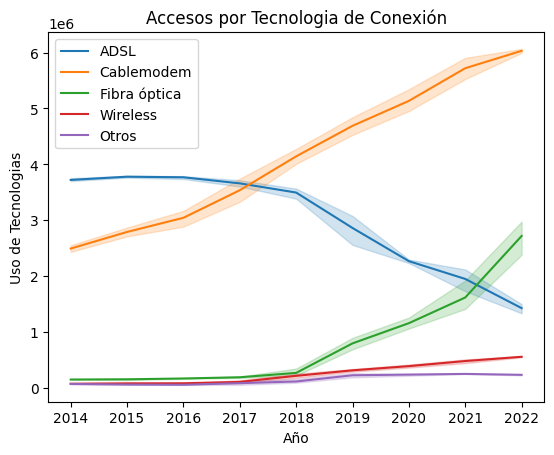

# Proyecto Individual de Analisis de Datos  

En este proyecto voy a tomar los datos de la [pagina del gobierno de la nacion](https://indicadores.enacom.gob.ar/datos-abiertos).

## EDA

Lo primero que hice fue definir los 3 KPIs que iba a usar en este proyecto los que son:

### KPI:

1. Aumentar la velocidad media de conexión a Internet en las provincias del interior del pais en un 30% en el próximo año. (4T 2022)
2. Aumentar en un 2% el acceso al servicio de internet para el próximo trimestre, cada 100 hogares, por provincia. (3T 2023)
3. Aumentar el uso de tecnología wireless en un 20% en el próximo año. (4T 2022)

 ## ETL:
 Cargue los archivos que iba a usar y empece con las transformaciones y la limpieza.
 Entre las transformaciones que hice estan: sacar espacios sobrantes de nombres de columnas y provincias
 Y para la limpieza: elimine valores faltantes y elimine errores de diferentes columnas.
 Además elimino los outliers de los DFs que me molestan para el analisis y busco si existen valores duplicados.

 ## Analisis:
 Como un analisis inicial empiezo por tomar solamente las partes de los DFs que me sirven para chequear los KPIs.  

 Empiezo por chequear el primer KPI y cuanto aumento la velocidad de descarga promedio en los diferentes años.  
 

 Luego verifico si aumento o disminuyo y cuanto el servicio de internet en los ultimos años.  
 

 Y para terminar verifico cuanto aumento la tecnologia Wireless en los ultimos años y obtengo despues este ultimo grafico:  
 

 ## Cierre
 Ya para terminar guardo datos en archivos kpi con los que luego hago los graficos en Power BI.
 Y guardo el resto de archivos sin Outliers para hacer unos graficos iniciales en la misma herramienta.

 ### Datos de contacto:
 LinkedIn: [Guido Biotti](https://www.linkedin.com/in/guido-biotti/)  
 Mail: biottiguido@gmail.com
